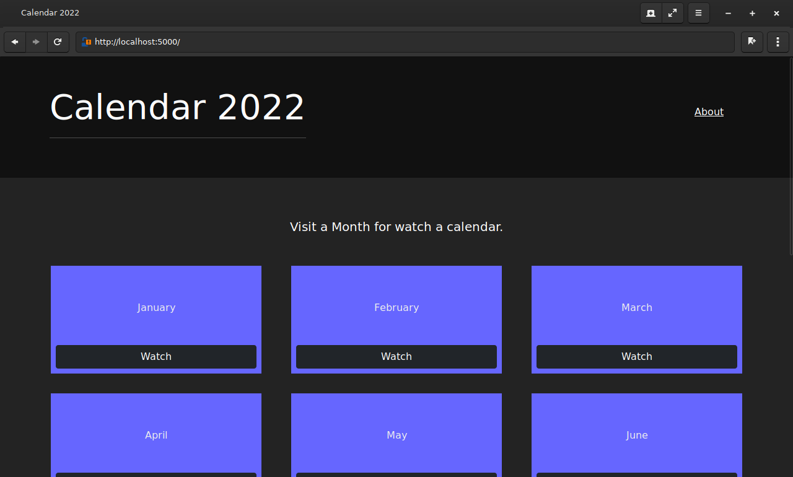

# Calendar App.


__This is a small web application of a calendar from 2022 year. Made with python-flask, bootstrap as css framework and javascript.__


## Installation.

```bash
git clone https://github.com/EduardYan/calendar-app.git
cd calendar-app/
```

### Dependencies.
Install with the requirements file (in this case with pip packages administrator, other as well):

```bash
pip3 install -r requirements.txt
```

## Run.

__Execute the index.py not app.py, app have some configurations.__

```bash
python3 index.py
```

Now you have this direction <a href="http://localhost:5000" target="_blank">http://localhost:5000</a>


## Screenshot.




## Errors or Bugs.

<a href="mailto:eduarygp@gmail.com">Contact me</a>
